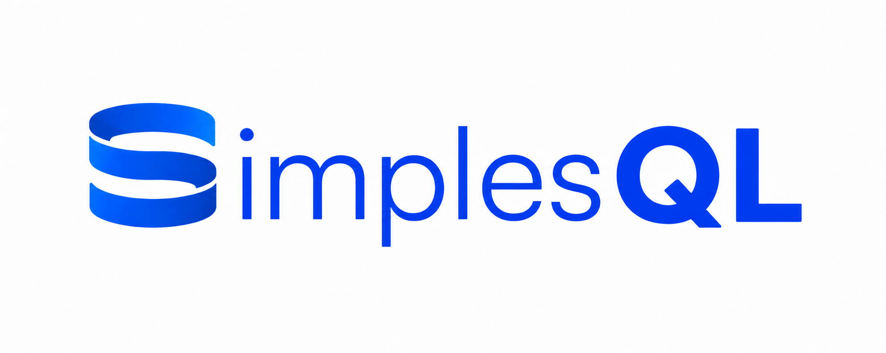
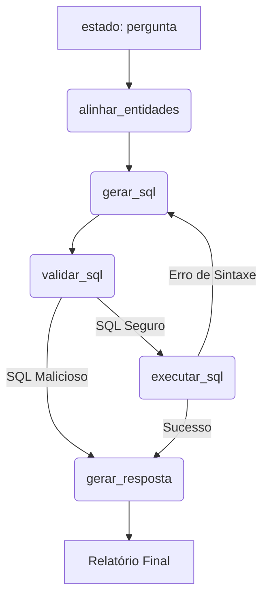

## PROJETO: Detalhes Técnicos

<p align="center">
	
</p>

## Visão geral
Este documento descreve a arquitetura, os componentes, as dependências e as decisões técnicas do projeto SimplesQL. O objetivo é fornecer contexto suficiente para desenvolvedores que queiram entender, estender ou implantar o sistema.

## Arquitetura
- Orquestração baseada em grafo: o fluxo de análise é modelado por um grafo de estados (`src/grafo.py`) usando `langgraph`. Cada nó do grafo é uma função que recebe e retorna partes do `EstadoAnalise`.
- Extração de entidades: extrai da pergunta do usuário com fuzzy match & interpretação de LLMs as melhores correspondências de entidades no banco (ex.: x360 ≈ Xbox360).
- Geração de SQL: um modelo especializado (instanciado em `src/modelos.py`) recebe um prompt (`src/prompts.py`) e retorna apenas uma string SQL.
- Validação: o nó de validação (`src/nos.py`) rejeita consultas que contenham comandos destrutivos (DROP, DELETE, UPDATE, INSERT, ALTER, TRUNCATE, CREATE TABLE).
- Execução: as queries válidas são executadas em DuckDB contra um CSV local (`db/vgsales.csv`) montado como view em memória.
- Interpretação: um modelo analista interpreta o resultado e gera um relatório formatado e auditável.




## Lógica dos nós

A robustez da extração de dados ocorre através da divisão de responsabilidades entre o banco de dados e as chamadas de API:

* **alinhar_entidades (Nó 0):** Resolve a ponte entre linguagem natural e o esquema do banco. Utiliza um LLM para expandir siglas famosas (ex: "GTA" para "Grand Theft Auto") e calcula a similaridade no DuckDB usando uma equação híbrida de contenção (`ILIKE`) e distância léxica (*Jaro-Winkler*), injetando o nome exato no estado.
* **gerar_sql (Nó 1):** Consome a intenção alinhada e traduz estritamente para sintaxe SQL de leitura.
* **validar_sql e executar_sql (Nós 2 e 3):** Atuam como cães de guarda. A validação bloqueia injeções destrutivas, e a execução roda a query válida no CSV local (`db/vgsales.csv`) mapeado em memória.
* **gerar_resposta (Nó 4):** Traduz os arrays numéricos brutos para um relatório auditável em formatação Markdown.

## Estratégia e seleção de modelos

Em vez de depender de um único modelo genérico, fragmentamos as tarefas cognitivas para otimizar precisão e custo no pipeline:

* **Modelo Extrator/Analista (cohere/north-mini-code:free):** Focado em linguagem natural para lidar com a expansão de siglas e a redação final. No Nó 0, a temperatura é cravada em 0 para induzir um comportamento determinístico de extração de dados (Named Entity Recognition).
* **Modelo SQL (openai/gpt-oss-20b:free):** Focado puramente em estruturar consultas eficientes, recebendo os enums de baixa cardinalidade diretamente via injeção de prompt.

## Execução do projeto

Para levantar o ambiente de análise dinâmico e testar as interações, siga os comandos abaixo após clonar o repositório:

* Instale as dependências vitais executando `pip install -r requirements.txt`.


* Configure a variável de ambiente `OPENROUTER_API_KEY` com sua credencial ativa.


* Inicie o servidor de interface web rodando `streamlit run app.py` diretamente no terminal.

## Testes

* Há scripts de teste em testes/ que simulam o fluxo e validam a integração entre módulos. Eles são executáveis como scripts independentes (não dependem de pytest, mas podem ser adaptados para ele).

## Contato e contribuição

* Abra issues para discutir mudanças e PRs para enviar contribuições. Siga o estilo e a estrutura já existente em src/.

```