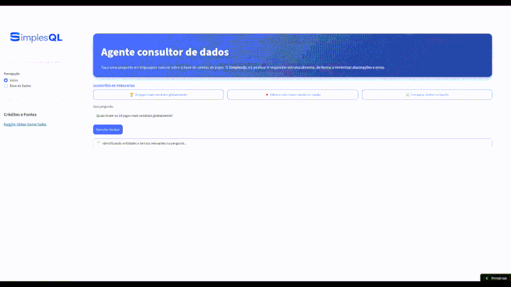

# SimplesQL: Assistente SQL com LangGraph

	

Uma ferramenta analítica e educacional que traduz linguagem natural em consultas SQL seguras, executa-as sobre um dataset CSV in-memory e gera relatórios com visualizações de dados dinâmicas.

## Demo

  

Por vezes, os modelos gratuitos ficam um tempo fora do ar; tente novamente mais tarde caso isto ocorra :/
- Acesse o projeto em: [https://simpleql.streamlit.app/](https://simpleql.streamlit.app/)

## Objetivo do projeto
- Provar um fluxo prático e auditável que combina geração de SQL por LLMs e execução in-memory.
- Demonstrar a orquestração de pipelines de análise de dados baseada em grafos de estado com o LangGraph.
- Apresentar conceitos avançados de IA em dados: Alinhamento Semântico, Self-Correction e DataViz guiado por meta-dados.

## Principais conceitos
- Resolução de Entidades: Alinhamento prévio de termos do usuário com o banco de dados (Fuzzy Matching) para evitar falhas de filtragem.
- Tradução controlada e Segura: O LLM gera a consulta SQL orientada por regras estritas, com validação que bloqueia comandos destrutivos.
- Ciclo de Auto-Correção: O pipeline reavalia e corrige automaticamente queries que apresentam falhas de sintaxe.
- Padrão Fail-Fast: Abortamento prematuro do fluxo caso o SQL seja inválido ou vazio, otimizando processamento.
- DataViz Determinístico: Geração de gráficos nativos através de saídas estruturadas (Pydantic).

## Tecnologias e componentes
- Linguagem e Interface: Python e Streamlit para o frontend reativo.
- Orquestração: `langgraph` para definir o grafo de estados e transições.
- Modelos de Linguagem: Adaptadores `langchain_core` e `langchain_openai` via OpenRouter.
- Banco e Estruturação: `duckdb` (processamento de dados) e Pydantic (validação de contratos JSON).
- Dados: Base Kaggle Video Game Sales (`db/vgsales.csv`).

## Começando
1. Crie um ambiente Python e ative-o.
2. Instale as dependências essenciais:

`pip install -r requirements.txt`

3. Crie um `.env` com a sua chave da API:

`OPENROUTER_API_KEY="sua_chave_aqui"`

4. Para iniciar a interface web interativa:

`streamlit run app.py`

5. Para depurar o fluxo completo no terminal:

`python testes/teste_fluxo_completo.py`

## Documentação técnica
- Para os detalhes de arquitetura, módulos e rotas, veja o [`PROJETO.md`](https://github.com/EstevaoMO/simpleql-langgraph/blob/main/PROJETO.md).

## Contribuições
- Melhorias de arquitetura, ajustes de prompts e reports de bugs são muito bem-vindos via issues ou PRs.
